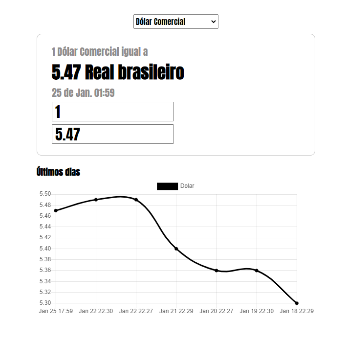

<h1 align="center">Cotação de Moedas</h1>

## Funções do projeto
Mostra a cotação da moeda selecionada atual.

Converte quantidade que usuário coloca da moeda  selecionada para Real brasileiro ou contrário.

Mostra gráfico dos ultímos dias 
  

## Imagem de demonstração

    

 
 

## Instalação
Você pode clonar o repositório ou baixar o .zip

Ao descompactar, é necessário rodar o composer pra instalar as dependências e gerar autoload.

Vá até a pasta do projeto, prompt ou terminal e execute:
>composer install

Depois é só aguardar.
  

